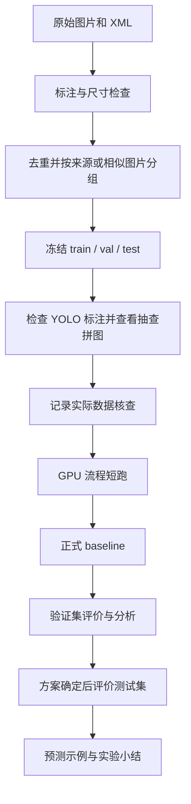

# 项目框架：检查这一份即可

状态：首版实现框架。数据获取、GPU 环境、真实训练与实测评价仍按步骤执行；框架测试不能替代模型实验。

当前检查节点：用户已要求暂不训练。只检查框架与准备数据；下文的训练命令为后续运行说明，本次不执行短跑或正式训练。

用户进一步要求按步骤进行：现在停在框架检查，不继续清洗数据或安装依赖。下一步再逐项核查真实标注；后续访问 Kaggle 优先尝试 Edge。

当前真实数据状态：原始 ZIP 已取得，包含 853 张图片和 853 份 XML。842 份通过初步尺寸/框检查，11 份有问题，其中存在框坐标超出图片边界的情况。严格检查已停止转换，未生成数据划分，也未修改原始标注。初查通过不等于完成视觉质量核查。

## 1. 本版做什么

图片输入后，模型输出人脸位置、口罩佩戴状态和置信度。先做三类：mask、no_mask、mask_incorrect。

预训练 YOLO11n + 人脸口罩状态数据微调，输入 640，baseline 最多 50 轮。训练参数放在 configs/baseline.yaml，类别与数据路径放在 configs/dataset.yaml。具体标注规则需根据真实数据抽查确认。

## 2. 每个文件负责什么

| 文件 | 职责 |
| --- | --- |
| src/download_data.py | 从原始发布入口获取数据，核查压缩包路径与冲突，完整解压后移入目标目录，保留压缩包、来源与哈希 |
| src/prepare_dataset.py | XML 转 YOLO，核查框，去除内容完全重复的图，按组固定数据划分 |
| src/check_dataset.py | 检查标注、类别分布和划分，生成标注抽查拼图 |
| src/review_dataset.py | 记录实际完成的标注抽查及来源核查，绑定具体数据版本 |
| src/environment.py | 查询 Python、依赖和 GPU 可用性 |
| src/train.py | 预检配置和最终参数；dry-run 打印计划，后续实际运行时保存版本、权重与日志 |
| src/evaluate.py | 保存总体与分类别指标，默认评价验证集 |
| src/predict.py | 保存新图片的预测框和 JSONL 检测结果 |
| tests/test_data_pipeline.py | 检查坐标转换、分组、防泄漏与数据版本记录 |
| tests/test_pipeline_integrity.py | 合成数据转换、清单一致性、配置校验、旧格式兼容与核查记录失效测试 |
| tests/test_label_validation.py | 标签字段、精确类别编号、归一化边界及转换输出兼容测试 |
| tests/test_entry_configs.py | YAML 与路径校验、训练计划参数、覆盖优先级及 CLI 无模型执行测试 |
| tests/run_regression.py | 在缓存临时目录累计执行所有现有回归测试 |

## 3. 流程



相似图片分组使用 dHash 距离，并支持提供拍摄来源 CSV。它能减少明显近重复泄漏，但不能保证识别出所有同视频或同人物来源；有来源信息时优先补充来源分组。

分组划分要求每个样本恰好出现一次，且每类至少存在于三个独立分组。算法在完整保留分组、覆盖各集合类别的约束下尽量接近目标比例；比例可能因分组大小而偏离。固定 seed 可复现，有限次数的启发式尝试仍可能找不到合法划分，此时停止并报告，不拆分来源分组。

## 4. 检查框架时重点看什么

1. 课程是否允许先完成口罩一个子任务，是否必须包含手套或护目镜。
2. 三类含义是否符合任务，尤其错误佩戴是否需要单独识别。
3. 人脸框作为位置输出是否符合你的期望。
4. 初始 50 轮、小型模型、图片预测演示是否符合课程工作量。
5. 最终提交是否还要求摄像头实时演示或特定报告格式。

没有额外课程限制时，按以上框架继续。实时摄像头演示可以在图片推理可靠后追加。

## 5. 当前即可检查的命令

框架搭建阶段曾验证：8 项关键测试通过，全部 CLI 帮助入口、代码编译检查和两种训练计划的 dry-run 通过。初版保存时在 `.venv` 复查受 Pillow 缺失及临时目录权限影响。后续已用系统 Python 3.14 的现有 Pillow/PyYAML 与项目缓存临时目录，在正常本机权限下完成 75 项累计回归测试；本轮重新验证两种 dry-run 与 8 个帮助入口。`.venv` 的依赖仍未准备完成，真实 YOLO 训练、评价、预测尚未执行。

后续调整以初版 `unittest` 的实际执行顺序为起点，新增回归由统一入口累计发现；同一测试类的方法按名称排序，不按源码中的定义位置排序：

| 顺序 | 测试入口 | 首先调用的项目功能 | 调整状态 |
| --- | --- | --- | --- |
| 1 | `BoxTests` | `prepare_dataset.convert_box` | 已补齐图片尺寸校验，6 项坐标测试通过 |
| 2 | `GroupTests` | `prepare_dataset.split_groups`，随后 `group_samples` | 已修正泄漏、样本覆盖及小规模划分，11 项分组测试通过 |
| 3 | `PipelineTests.test_archive_*` | `download_data.extract_archive` | 已修正路径碰撞、覆盖、失败残留及 Windows 短暂移入错误，11 项解压测试通过 |
| 4 | 原有组合测试与 `IntegrityTests` | 转换、校验、配置与数据版本核查 | 已补齐清单、标签哈希、划分列表与指纹校验，共 16 项组合测试通过 |
| 5 | `PipelineTests.test_label_fields_and_geometry` 与 `LabelTests` | `check_dataset.read_labels` | 已补齐精确类别、字段范围、边缘舍入及 BOM 校验，共 11 项标签测试通过 |
| 6 | `EntryConfigTests` | 共享配置读取，随后训练计划与 CLI | 20 项预检与兼容测试通过；评价、预测入口的其余参数待下一轮检查 |

每轮调整后累计复查全部现有测试：

```powershell
python tests/run_regression.py
```

选择已经装有 Pillow 与 PyYAML 的 Python；当前系统 Python 满足这些测试依赖。此入口只在 `.cache/tests/` 创建临时合成样本，并在结束时清理，不修改真实数据或运行 YOLO。

解压测试包含真实的目录重命名：Codex 沙箱可能阻止该操作，应允许测试命令在沙箱外运行后验证，不用跳过此测试。解压函数只接受不存在或为空的目标目录；ZIP 路径不做静默改名，大小写碰撞、冗余路径、特殊文件和文件/目录冲突均会拒绝。解压先在同级临时目录完成，再移入目标目录，失败时清理临时内容。

新清单使用 `format_version: 1`，记录图片与标签文件的哈希；检查时核对类别编号、完整条目、分组和划分列表。数据指纹 v2 同时绑定类别名、图片、全部标签、清单和划分文件，任何变化均须重新核查。旧清单可读取，但没有标签哈希时不能核对冻结的标签几何；旧核查记录因指纹算法升级而失效，须实际检查后重新记录。

标签中心坐标必须在 `(0, 1)`、宽高在 `(0, 1]`，类别编号必须是合法整数。原始数值先精确校验，再返回浮点结果；框边缘允许最多 `1e-8` 的舍入误差，以兼容转换程序的八位小数输出。空标签可以表示无目标图片，读取支持 UTF-8 BOM；本检查不自动裁剪或修改标签。

配置读取拒绝显式重复的 YAML 字段，仍支持别名与合并覆盖。数据配置的 `path` 相对该 YAML 文件解析（省略时为该 YAML 所在目录），`train/val/test` 相对数据根目录解析；训练配置的 `data/model/project` 仍相对项目根目录解析。空字符串、布尔值等不能作为这些路径字段。

训练计划以 YAML 配置为基础，再应用 smoke 设置，最后应用 CLI 覆盖，检查最终有效参数。轮数、batch、imgsz 必须为正整数，patience、workers、seed 为非负整数；设备支持 `auto`、`cpu` 或一个非负 CUDA 编号。实验名称仅允许字母、数字、下划线、连字符，拒绝 Windows 保留设备名。配置错误以简短提示退出，`--dry-run` 不创建实验目录、加载模型或读取真实数据内容；扩展 YOLO 参数和设备可用性仍留给实际运行验证。

如果只复查第一项，可在项目根目录运行，无需 Pillow、训练数据或 Ultralytics：

```powershell
.\.venv\Scripts\python.exe -m unittest tests.test_data_pipeline.BoxTests -v
```

在项目根目录运行，无需训练数据或 Ultralytics：

```powershell
python -m src.train --dry-run
python -m src.train --smoke --dry-run
python -m unittest discover -s tests -v
```

前两条只打印计划，第三条使用临时的合成测试样本检查程序逻辑；测试样本不进入项目数据集，也不产生模型分数。

## 6. 实施命令顺序

这些是运行入口；完成依赖安装和原始数据准备后逐步执行。

```powershell
python -m src.environment
python -m src.download_data
python -m src.prepare_dataset
python -m src.check_dataset
```

如果原始发布站点要求浏览器登录，手动从原始 Kaggle 页面下载 ZIP，再运行：

```powershell
python -m src.download_data --archive "下载的压缩包的完整路径.zip"
```

检查 results/data_check 中三组标注拼图。确认框、类别、坐标约定和来源后，用真实检查结论记录，不要照抄占位内容：

```powershell
python -m src.review_dataset --reviewer "检查者" --notes "实际抽查结果、发现的问题和处理方法" --license-source "实际核对的发布页或许可文件"
python -m src.train --smoke
python -m src.train
python -m src.evaluate
python -m src.evaluate --split test --final-test
python -m src.predict --source dataset/images/test
```

GPU 不可用时会给出清晰错误。若仅需小型 CPU 流程检查，可显式指定 --device cpu。实验名称已经存在时不覆盖历史结果；用 --name 指定新名称，例如 baseline_02。

若因显存不足改成 batch=4，应使用新实验名称并记录实际参数。评价与预测的 --weights 也要改成该实验保存的权重路径。

## 7. 保存的结果

- dataset/manifest.json：清单格式版本、图片与标签哈希、固定划分、分组、去重与排除记录。
- results/data_check/：标注检查报告、抽查图片清单和拼图。
- results/smoke_01/：流程检查结果，不当作最终模型表现。
- results/baseline_01/：真实训练后生成的权重、曲线、环境与参数记录。
- results/evaluations/：每次评价的数值和图。
- results/predictions/：预测图片及每个框的类别、置信度、坐标。

目录中没有训练生成的权重与指标前，项目仍处于准备或实现阶段。
